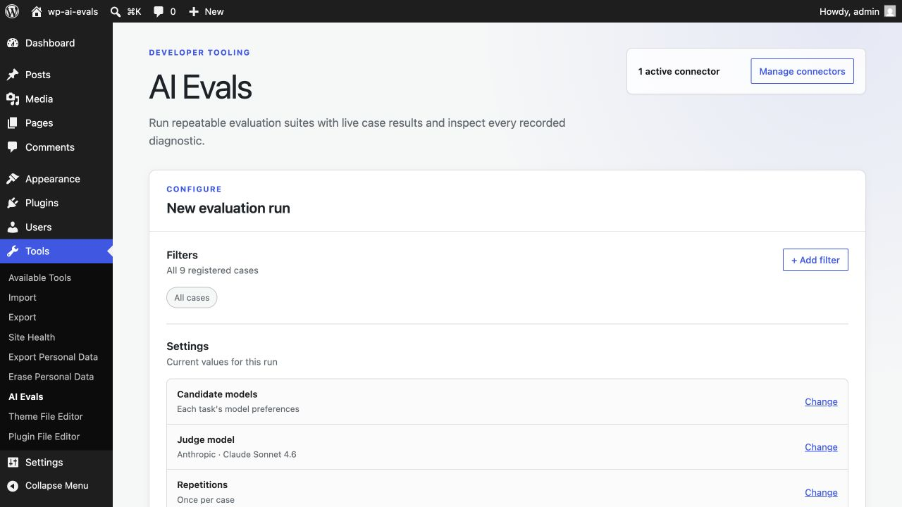
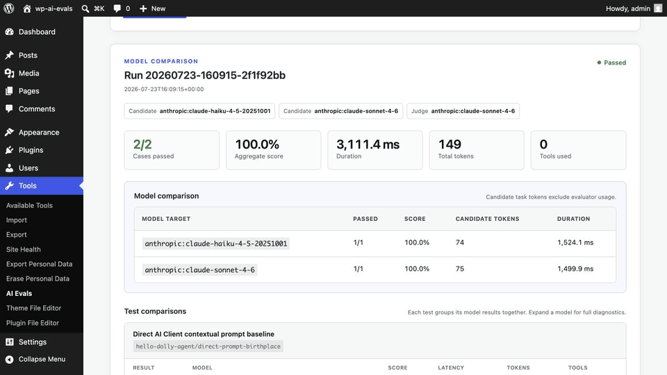

# WordPress AI Evals

A development-only evaluation harness for plugins built with the WordPress AI Client, Connectors API, and Abilities API.

Plugin authors register reusable evaluation suites and run them from **Tools → AI Evals** or WP-CLI. The same cases can exercise deterministic contracts, custom scorers, performance budgets, LLM judges, repeated samples, and exact cross-provider model comparisons.

> **Status:** Early development. The Composer package is `automattic/ai-evals`, but it is not published yet.





## What it provides

- Multiple independently registered suites with case, suite, and tag filtering.
- WordPress-native live runs, previous-run inspection, and detailed diagnostics.
- WP-CLI output for humans, JSON consumers, and JUnit-compatible CI.
- Exact candidate model overrides with an independent, fixed judge model.
- Provider, model, token, tool, latency, score, failure, rubric, and optional provider-reported cost metadata.
- Development-only loading with production safeguards.

## Scope

The harness follows the same core data → task → evaluator workflow as
general-purpose eval systems, with deterministic and custom scorers, LLM
judges, repeated samples, model comparisons, stored runs, and CI output. Its
scope is deliberately WordPress-native, local development tooling—not hosted
collaboration or production observability. Baseline comparisons, first-class
traces, richer datasets, and statistical reporting remain on the
[roadmap](docs/roadmap.md).

## Requirements

- WordPress 7.0 or newer.
- PHP 7.4 or newer.
- A non-production WordPress environment.
- At least one provider configured under **Settings → Connectors** for AI-backed tasks or judges.

## Installation

Until the package is published, add a checkout as a Composer path repository from the plugin under test:

```bash
composer config repositories.automattic-ai-evals path ../wp-ai-evals
composer require --dev automattic/ai-evals:@dev
```

Once published:

```bash
composer require --dev automattic/ai-evals
```

Keep the plugin's evaluation registration in its root `autoload-dev` so distributed builds omit both the harness and the suites:

```json
{
    "autoload-dev": {
        "files": [
            "evals/register.php"
        ]
    }
}
```

## Quick start

```php
<?php

use Automattic\AiEvals\EvaluationCase;
use Automattic\AiEvals\Evaluator\ContainsText;
use Automattic\AiEvals\Registry;
use Automattic\AiEvals\Suite;

add_action(
    'wp_ai_evals_init',
    static function (Registry $registry): void {
        $registry->register(
            Suite::make('my-plugin', 'My Plugin')
                ->describe('Quality checks for the content assistant.')
                ->add_case(
                    EvaluationCase::make('summarizes-post', 'Summarizes a post')
                        ->input([
                            'title' => 'Caching in WordPress',
                            'content' => 'A persistent object cache avoids repeated database work.',
                        ])
                        ->task(
                            static fn(array $input) => my_plugin_summarize(
                                $input['title'],
                                $input['content']
                            )
                        )
                        ->expected('cache')
                        ->evaluate_with(new ContainsText())
                        ->tag('smoke', 'quality')
                )
        );
    }
);
```

Multiple plugins can register suites without coordinating load order. Duplicate suite and case IDs are rejected.

## Running evaluations

Open **Tools → AI Evals** to filter cases, change candidate or judge models, run cases live, inspect diagnostics, and reopen previous runs.

The same registry and runner are available from WP-CLI:

```bash
wp ai-evals list
wp ai-evals models
wp ai-evals run
wp ai-evals run --tag=smoke,safety
wp ai-evals run --case=my-plugin/summarizes-post --repeat=5
wp ai-evals run \
  --model=openai:gpt-5.4,anthropic:claude-sonnet-4-6 \
  --judge-model=google:gemini-3.1-pro-preview
wp ai-evals run --format=junit > ai-evals.xml
```

The command exits non-zero when a case fails or errors. Use `--fail-under=0.85` to add an aggregate score gate.
If a suite executes permission-protected Abilities, use WP-CLI's global
`--user=<login>` option so their permission callbacks run with the intended
WordPress user.

## Keeping it out of production

Install the package with `require-dev`, register suites through the plugin's root `autoload-dev`, and build release artifacts with:

```bash
composer install --no-dev --classmap-authoritative
```

The runtime also stays disabled when `wp_get_environment_type()` is `production`. CI environments that intentionally evaluate a production-shaped install can opt in before Composer loads:

```php
define('WP_AI_EVALS_ENABLED', true);
```

Defining the constant as `false` always disables the harness.

## Example and documentation

The [Hello Dolly AI example](examples/hello-dolly-ai) is a working WordPress chat block and agent with two suites covering callbacks, direct AI Client prompts, Abilities, deterministic evaluators, LLM rubrics, tools, and model comparisons.

```bash
composer install
corepack enable pnpm
pnpm install
pnpm demo:setup
pnpm env:start
```

- [Authoring evaluation suites](docs/authoring-evals.md)
- [Architecture and extension points](docs/architecture.md)
- [Release automation and package contents](docs/releases.md)
- [Roadmap](docs/roadmap.md)
- [Hello Dolly setup and commands](examples/hello-dolly-ai/README.md)

## Development

```bash
composer install
corepack enable pnpm
pnpm install
pnpm check
```

The PHP check includes syntax validation, WordPress Coding Standards, and the
unit suite. Run `composer phpcs` for coding standards alone or `composer phpcbf`
to apply safe automatic fixes.

Licensed under GPL-2.0-or-later.
